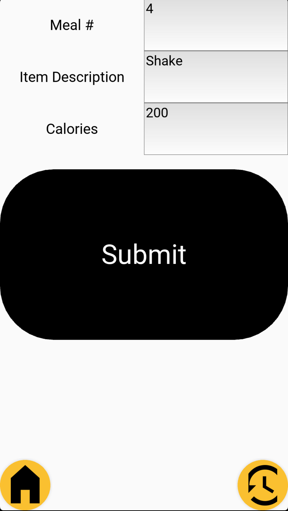
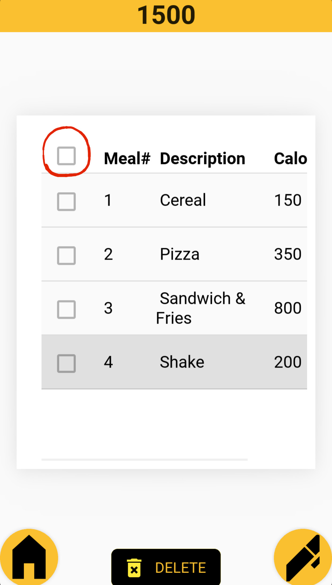

# 
Want to calculate your calories? You can CALc it!</a>

### Built With

* [Kivy](https://kivy.org/)
* [KivyMD](https://kivymd.readthedocs.io/en/latest/#)
* [TinyDB](https://tinydb.readthedocs.io/en/latest/)

(<a href="#top">back to top</a>)

<!-- GETTING STARTED -->
# Getting Started

This application is a user-friendly, caloric consumption calculator. The user's data automatically resets daily. The daily reset allows users to have an app with minimal data storage requirements.

iOS & Android compatable.

(<a href="#top">back to top</a>)

<!-- USAGE EXAMPLES -->
# Usage

NOTE: KivyMD DataTables are in constant change, due to optimizations and bugs. The datatable has a specific imperfection in its checkbox functionality. When deleting entries in your history screen, please tap and then un-tap the "Select-All" checkbox.

The "Select-All" checkbox can be seen in the 3rd screenshot below (checkbox in the red circle).

(<a href="#top">back to top</a>)

# Screenshots:

 

(<a href="#top">back to top</a>)

<!-- CONTACT -->
# Contact

jlucode@gmail.com

Project Link: [https://github.com/your_username/repo_name](https://github.com/your_username/repo_name)

(<a href="#top">back to top</a>)
